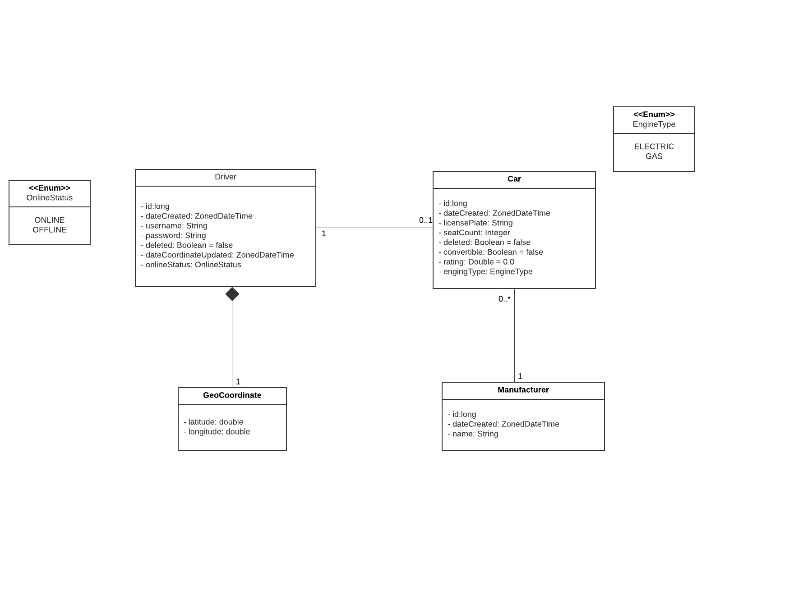

# Taxi App

This project is an example application built on a small web service using various technologies such as Java 17, Spring Boot, an in-memory H2 database, and Maven. The application provides endpoints to manage cars and drivers.

## Usage

### Car API

The Car API offers CRUD operations to manipulate car entities. A car has attributes such as license plate, seat count, convertible, rating, engine type (electric, gas), and manufacturer. The available endpoints are as follows:

- `GET /v1/cars/{carId}`: Retrieve information about a specific car.
- `POST /v1/cars`: Create a new car.
- `DELETE /v1/cars/{carId}`: Delete a car.
- `PUT /v1/cars/{carId}`: Update the rating of a car.
- `GET /v1/cars`: Find cars by engine type.

### Driver API

The Driver API provides CRUD operations to manipulate driver entities. A driver is defined by attributes such as username, password, online status, geo-coordinate, and car. Drivers can select and deselect cars, and their data can be manipulated through create, update, or delete operations. The available endpoints are as follows:

- `GET /v1/drivers/{driverId}`: Retrieve information about a specific driver.
- `POST /v1/drivers`: Create a new driver.
- `DELETE /v1/drivers/{driverId}`: Delete a driver.
- `PUT /v1/drivers/{driverId}`: Update the location of a driver.
- `GET /v1/drivers`: Find drivers by online status.
- `PUT /v1/drivers/{driverId}/cars/select/{carId}`: Select a car for a driver.
- `DELETE /v1/drivers/{driverId}/cars/deselect`: Deselect a car for a driver.
- `GET /v1/drivers/search`: Search for drivers using custom criteria (e.g., username, online status, car characteristics).

## Authentication

The application uses Basic authentication. You will be prompted to authenticate at (http://localhost:8080/login). Credentials are as follows:

- Username: `taxi`
- Password: `2#NahmjeH&m$`

## Simplified UML

